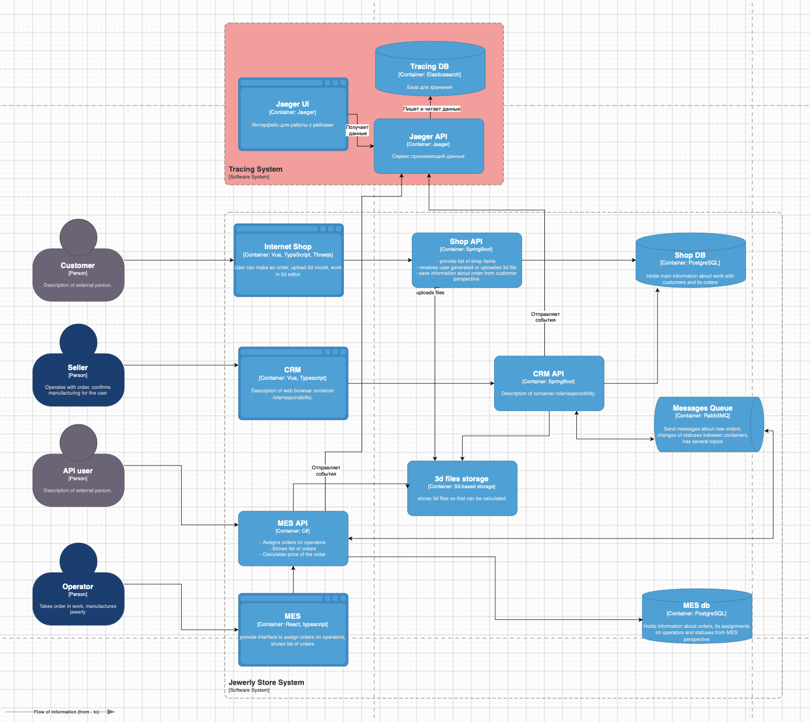

# Мотивация

В текущей архитектуре отсутствует сквозная трассировка заказов. Заказ может «зависнуть»:

- в RabbitMQ (необработанное сообщение) между MES и CRM (нет подтверждения)
- в процессе расчёта стоимости (до 30 минут, иногда без признаков жизни)
- в CRM без движения после APPROVED

Внедрение трейсинга позволит:

- Быстро определить, на каком этапе и в каком сервисе "застрял" заказ
- Видеть цепочку действий (и задержек) от создания до отгрузки
- Повысить качество SLA и надёжность API для партнёров
- Улучшить командное взаимодействие при инцидентах

Влияние на метрики:

- Своевременное обнаружение и устранение проблем
- Снижение времени простоя заказов
- Снижение процента "потерянных" заказов
- Повышение удовлетворённости клиентов
- Своевременное масштабирование и оптимизация сервисов

# Предлагаемое решение

Технологии: - OpenTelemetry как стандарт трассировки - Jaeger как система хранения трейсинга

Критические точки, где может зависнуть заказ:

- После SUBMITTED — если сообщение до MES не дошло.
- После PRICE_CALCULATED — если не обработано в CRM
- После MANUFACTURING_STARTED — если MES не отправляет события
- После SHIPPED — если CRM не закрывает заказ
- При сбоях RabbitMQ

Какие данные должны попадать в трейсинг:

- trace_id, span_id, parent_span_id
- order_id
- timestamp
- имя сервиса
- endpoint или operation
- status (OK / FAIL / TIMEOUT / RETRY)
- duration
- error (если есть)
- id пользователя или партнёра (если применимо)

При помощи мониторинга и алертинга будем отслеживать что заказ "завис". При помощи трейсинга сможем быстро найти, где именно это произошло.

# Компромиссы

1. MES — сторонняя C#-система. Потребуется больше времени на внедрение трейсинга
2. RabbitMQ требует отдельной работы по обёрткам/middleware.
3. Хранение трейсинга в Jaeger/Tempo — объёмные данные, нужно продумать TTL

# Безопасность

Получить доступ к трейсингу смогут только:

1. Только пользователи с ролью «Developer» или «DevOps»
2. Подключение через корпоративную учётку или SSO
3. Обезличивание персональных данных в trace
4. HTTPS и защита trace-сервиса firewall'ом.
