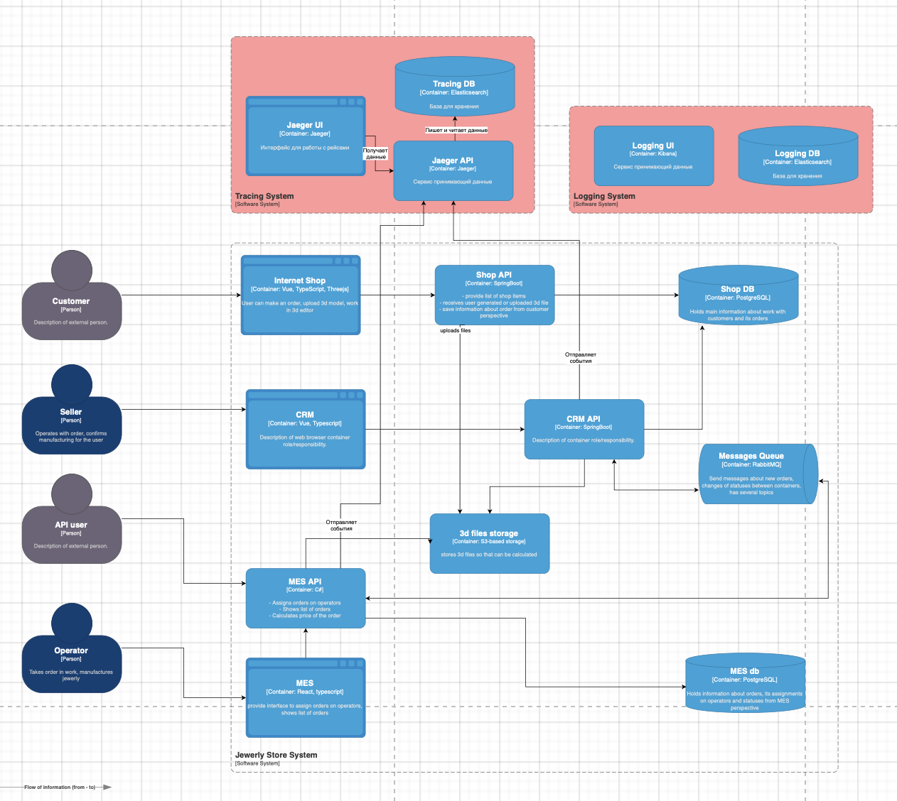

# Мотивация

В текущей системе:

Инженеры вынуждены узнавать о сбоях от клиентов.
Для расследования проблем требуется вручную анализировать данные в нескольких системах.

Что даст внедрение логирования:

- Сокращение времени на разбор инцидентов
- Выявление технических проблем до обращений клиентов
- Улучшение клиентского опыта

Метрики, на которые повлияет логирование:

- Кол-во обращений в поддержку — уменьшится.
- Кол-во нерешённых инцидентов — уменьшится.
- Время на расследование инцидента — уменьшится.
- SLA по поддержке — улучшится

Какие системы логировать в первую очередь и почему:

- CRM - Изменение статусов заказов
- MES - главная точка входа заказов

Какие логи нужны (INFO):

- Создание заказа timestamp, order_id, user_id, source
- Изменение статуса заказа timestamp, order_id, old_status, new_status, service
- Аутентификация пользователя timestamp, user_id, action, result

# Предлагаемое решение

Технологии:

- Формат: JSON logs
- Агрегация логов: Logstash
- Хранилище логов: Elasticsearch
- Визуализация: Grafana
- Мониторинг: Prometheus
- Поиск: Kibana

Политика хранения и безопасности:

- Хранение: 14 дней для всех логов, 90 дней — для ошибок
- Индексы: по сервисам (например, shop-api-logs-_, crm-logs-_)
- Логи очищаются от персональных данных до отправки в хранилище
- Доступ к логам — только через SSO

# Превращение логов в систему анализа

Настроить алерты: например - >10 ошибок API за 1 минуту.
Добавить анализ аномалий:

- резкий рост входящих запросов
- рост 500-х
- падение событий order_created при высокой нагрузке

Настроить дашборды:

- кол-во заказов по статусам
- топ ошибок по сервисам.

# Выбор технологии логирования

| Критерий                  | ELK (Elastic)   | OpenSearch            | Splunk        | Loki         |
| ------------------------- | --------------- | --------------------- | ------------- | ------------ |
| Лицензия                  | Elastic License | Apache 2.0            | Проприетарная | Apache 2.0   |
| Масштабируемость          | Хорошая         | Хорошая               | Очень высокая | Средняя      |
| Стоимость                 | Умеренная       | Бесплатная            | Высокая       | Низкая       |
| Аналитика и поиск         | Продвинутые     | Сопоставимы с ELK     | Отличные      | Ограниченные |
| Интеграция с мониторингом | Kibana          | OpenSearch Dashboards | Splunk UI     | Grafana      |
| Порог входа/обучения      | Средний         | Средний               | Высокий       | Низкий       |
