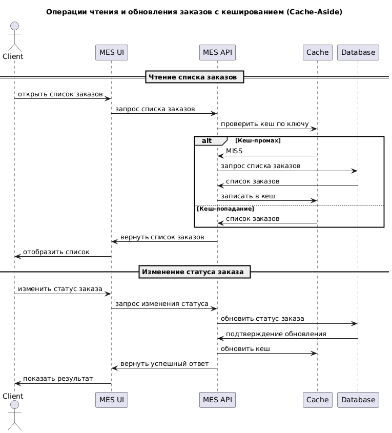

# Мотивация

Система MES (управление производством) работает медленно:

- Страницы у операторов долго загружаются
- Новые клиенты недовольны скоростью выполнения заказа
- Повышенная нагрузка на БД и API-сервисы.

Причины:

- Повторяющиеся запросы к одним и тем же данным (например, справочники, статусы, истории заказов)
- Отсутствие кеширования данных, что приводит к избыточным запросам к БД и API

Что даёт кеширование:

- Повышение скорости отклика интерфейса
- Снижение нагрузки на БД и API
- Стабильная работа интерфейсов при высоком трафике.

Что кешируем:

- Список заказов (read-only)
- Справочники
- Детали заказа

# Предлагаемое решение

Тип кеширования: серверное

- Влияет на всё приложение (и MES, и CRM)
- Централизованный контроль
- Нет зависимости от браузера пользователя

Почему не клиентское: оно хорошо для UX, но не решает основную проблему — нагрузку на базу и сеть.

Паттерн кеширования: Cache-Aside

| Паттерн       | Подходит | Почему                                            |
| ------------- | -------- | ------------------------------------------------- |
| Cache-Aside   | Да       | Прост в реализации, гибко управляется приложением |
| Write-Through | Нет      | Ненужная задержка при записи данных               |
| Refresh-Ahead | Нет      | Сложнее внедрять, пока избыточно по объёму данных |

Стратегия инвалидации кеша: программная и по ключу.
Инвалидация вручную при изменении: при обновлении статуса заказа.
По TTL — для справочников: 24 часа или при перезапуске сервиса.

| Стратегия                 | Подходит | Почему                                                                      |
| ------------------------- | -------- | --------------------------------------------------------------------------- |
| По TTL                    | Да       | Уместно для справочников, обновляются нечасто                               |
| По ключу                  | Да       | Гибкость для заказов и клиентов, можно инвалидировать по конкретному заказу |
| Программная               | Да       | Контроль при изменении данных, например, при обновлении статуса заказа      |
| Временная (по расписанию) | Нет      | Не всегда своевременно, может привести к устареванию данных                 |
| Инвалидация по версии     | Нет      | Сложно внедрять, не нужно на этом этапе                                     |

# Вывод

Для текущей задачи (ускорить работу MES и снизить нагрузку на БД) оптимален вариант серверное кеширование с паттерном Cache-Aside. Он легко внедряется, не требует серьёзной перестройки системы и даст ожидаемый прирост производительности.
